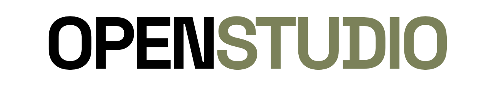

<p align="center">
  
</p>

<p align="center"><b>An open-source AI creative studio - image, video, cinema, faceless reels, a script-to-film agent and more, all powered by your own MuAPI key.</b></p>

OpenStudio bundles a full suite of generative-media tools behind one clean interface. Bring your [MuAPI](https://muapi.ai) access key and generate across 200+ image and video models - Nano Banana, GPT Image, Seedream, Imagen, Seedance, Kling, Veo, Sora, Hailuo and many more.

---

## Features

| Module | What it does |
|--------|--------------|
| **Image Studio** | Generate & edit images across 50+ models. |
| **Video Studio** | Text-to-video and image-to-video (Seedance, Kling, Veo, Sora, Hailuo). |
| **Video Tools** | Video-to-video utilities - watermark removal and Kling motion control. |
| **Agent** | Script-to-film agent: writes a shot list, storyboards keyframes, then animates each scene. |
| **Storyboard** | One prompt in, a fully shot-listed board out, rendered live. |
| **Scripts** | Viral, platform-tuned scripts with engineered hooks, beats and CTAs. |
| **Reels** | 12 faceless reel styles - script, visuals and voiceover in one click. |
| **Cinema Studio** | Compile real camera language (body, lens, aperture, move, lighting, grade) into every prompt. |
| **Marketing Studio** | Product-referenced ad videos from your assets. |
| **Lip Sync / Audio / AI Clipping / Vibe Motion** | Talking portraits, audio generation, auto-highlight clipping and kinetic motion graphics. |
| **Workflows** | Chain models into reusable pipelines. |

---

## One-command install

Copy, paste, run - it clones, installs, builds and launches OpenStudio on `localhost`, then opens your browser.

**macOS / Linux**

```bash
curl -fsSL https://raw.githubusercontent.com/generalizingai/OpenStudio/main/install.sh | bash
```

**Windows (PowerShell)**

```powershell
irm https://raw.githubusercontent.com/generalizingai/OpenStudio/main/install.ps1 | iex
```

Requires [Node.js](https://nodejs.org/) 18+ and git. You'll be prompted for your [MuAPI key](https://muapi.ai/access-keys) on first use - it's stored locally in your browser and sent only to MuAPI through the app's own proxy routes.

---

## Manual setup

```bash
git clone https://github.com/generalizingai/OpenStudio.git
cd OpenStudio
npm run setup          # install dependencies + build workspace packages
npm run dev            # http://localhost:3000
```

### Desktop app (optional)

```bash
npm run electron:dev            # run the Electron desktop build
npm run electron:build          # package a native app (mac / win / linux)
```

---

## Tech Stack

- **Next.js 15** (App Router) + **React 19**
- **Tailwind CSS** with a scoped design system for the creative modules
- **Electron** for the optional desktop build
- Generation runs entirely through your MuAPI key via server-side proxy routes - no keys ever reach the browser directly.

---

## Project Layout

```
OpenStudio/
├── app/                      # Next.js routes + API proxy
├── components/               # App shell (StandaloneShell, ApiKeyModal)
├── packages/
│   ├── studio/               # Studio component library (all creative modules)
│   ├── Vibe-Workflow/        # Workflow builder package
│   ├── Open-Poe-AI/          # Agent package
│   └── Open-AI-Design-Agent/ # Design-agent package
├── electron/                 # Desktop build
└── next.config.mjs
```

---

## License

[MIT](LICENSE) © OpenStudio Contributors
